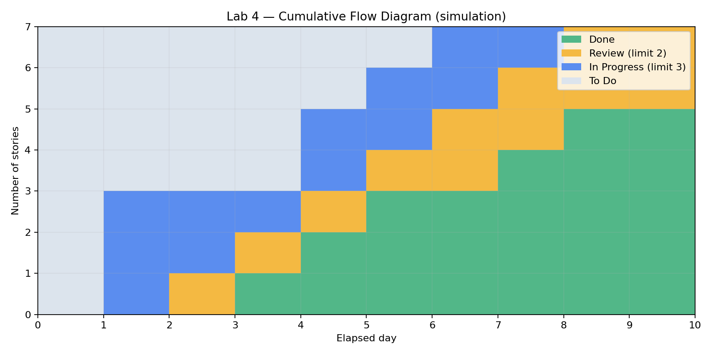

# Lead Time, Cycle Time ба урсгалын хэмжилт

## Тооцох нөхцөл

[flow-data.csv](flow-data.csv) нь сургалтын жишээ өгөгдөл. D0 нь бүх 7 картыг самбарт оруулсан мөч; D1–D10 нь дараагийн дараалсан дасгалын өдрүүд. Бодит огноо, амралтын өдрийг тооцоогүй. Үзүүлэлтийн нэгж нь өнгөрсөн **өдөр**, хөгжүүлэгчийн ажилласан цаг биш.

Шилжилт Dn мөчид болсон гэж үзнэ; тухайн мөчид өмнөх үе шатны тооноос хасаж, дараагийн үе шатанд оруулна. Жишээ нь Started ≤ Dn < Review үед карт In Progress-д байна. Ижил мөчид баруунаас зүүн тийш шилжүүлж сул зай гаргасны дараа дараагийн ажлыг татна.

- **Lead Time = Done − Created**
- **Cycle Time = Done − Started** (Review болон дундах хүлээлт багтана)
- **Waiting Time = Started − Created** (зөвхөн эхлэхийн өмнөх хүлээлт)
- **Lead Time = Waiting Time + Cycle Time**
- **Throughput = хугацаанд дууссан картын тоо / хугацааны урт**

## Story тус бүрийн үр дүн

| ID | Created | Started | Review | Done | Lead | Cycle | Waiting |
|---|---:|---:|---:|---:|---:|---:|---:|
| US-01 | 0 | 1 | 3 | 4 | 4 | 3 | 1 |
| US-02 | 0 | 1 | 2 | 3 | 3 | 2 | 1 |
| US-09 | 0 | 1 | 4 | 5 | 5 | 4 | 1 |
| US-10 | 0 | 4 | 5 | 7 | 7 | 3 | 4 |
| US-03 | 0 | 4 | 6 | 8 | 8 | 4 | 4 |
| US-05 | 0 | 5 | 7 | 10 | 10 | 5 | 5 |
| US-11 | 0 | 6 | 8 | 10 | 10 | 4 | 6 |
| **Нийт** | | | | | **47** | **25** | **22** |
| **Дундаж** | | | | | **6.71** | **3.57** | **3.14** |

US-05: Lead = 10 − 0 = **10 өдөр**; Cycle = 10 − 5 = **5 өдөр**; Waiting = 5 − 0 = **5 өдөр**. Иймд 10 = 5 + 5.

Дундаж Lead = 47/7 = 6.71 өдөр; Cycle = 25/7 = 3.57 өдөр; Waiting = 22/7 = 3.14 өдөр. Throughput = 7/(10−0) = **0.70 story/өдөр**. D0–D10 хүснэгт 11 агшны зурагтай боловч өнгөрсөн интервал 10 өдөр тул 11-д хуваахгүй.

## CFD-д зориулсан өдөр тутмын тоо



| Өдөр | To Do | In Progress | Review | Done | Нийт |
|---|---:|---:|---:|---:|---:|
| D0 | 7 | 0 | 0 | 0 | 7 |
| D1 | 4 | 3 | 0 | 0 | 7 |
| D2 | 4 | 2 | 1 | 0 | 7 |
| D3 | 4 | 1 | 1 | 1 | 7 |
| D4 | 2 | 2 | 1 | 2 | 7 |
| D5 | 1 | 2 | 1 | 3 | 7 |
| D6 | 0 | 2 | 2 | 3 | 7 |
| D7 | 0 | 1 | 2 | 4 | 7 |
| D8 | 0 | 0 | 2 | 5 | 7 |
| D9 | 0 | 0 | 2 | 5 | 7 |
| D10 | 0 | 0 | 0 | 7 | 7 |

CFD-г байгуулахад X тэнхлэгт өдөр, Y тэнхлэгт картын тоо авч, доороос нь Done, Review, In Progress, To Do-г давхарласан талбайгаар зурна. Давхаргын хилийн утгууд: Done; Done+Review; Done+Review+In Progress; Нийт. Review-ийн давхаргын зузаан нь тухайн үеийн хянагдаж байгаа картын тоо болно.

## Дүн шинжилгээ

- In Progress хамгийн ихдээ 3, Review хамгийн ихдээ 2 карт: WIP зөрчөөгүй.
- Review D6–D9 үед хязгаартаа хүрсэн. Энэ нь тухайн шатны хүчин чадал, хүлээлтийг шалгах дохио; дан ганц 4 өдрийн жишээгээр байнгын bottleneck гэж батлахгүй.
- D9-д шинэ Done гараагүй; D10-д 2 карт дууссан. Хяналтын ажлыг жигд тараах боломжийг хэлэлцэнэ.
- US-11 хамгийн удаан эхлэхээ хүлээсэн (6 өдөр). US-05 хамгийн урт Cycle Time-тай (5 өдөр).
- Throughput нь story тоо, 29 SP нь харьцангуй ажлын хэмжээ. Эдгээрийг адил нэгж гэж үзэхгүй; story-ийн хэмжээ өөр тул цаашдын таамаглалд хэмжилтийн олон мөчлөг хэрэгтэй.

## Дахин тооцох

Репозиторийн үндсэн хавтсаас:

```bash
python lab4/calculate_metrics.py
```

Windows дээр `python` ажиллахгүй бол `py lab4/calculate_metrics.py` хэрэглэнэ. Python 3 болон стандарт сангаас өөр хамааралгүй. Скрипт хугацааны дараалал, давхардсан ID, өдөр бүрийн WIP-г шалгаж, дээрх тооцоог гаргана.
